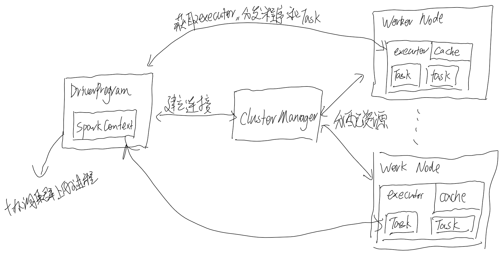

# Spark Cluster Mode

## Cluster Mode Overview

### Components

* Spark 的应用程序在集群上是相互独立的进程的集合，它们由主程序中的SparkContext（driver program）进行协调。
* 在集群上运行Spark程序，SparkContext需要连接集群管理器，集群管理器有多种类型，它们主要负责给应用分配资源；连接成功后Spark会获取可以进行计算和存储数据的executors，这些executors存在于集群的节点上；然后SparkContext会将应用程序的代码（jar包或python文件）分发给executors；最后SparkContxt会向executors分配tasks进行执行。
    
* 每个程序都拥有自己的executor进程，这些executor进程在程序运行期间不会被抢占，并以多线程的形式运行分配到的Task。这有利于隔离在集群上运行的不同应用程序，从driver program角度上来看，一个driver只能调度自己拥有的任务，从executor的角度来看，不同应用程序的Task运行在不同的JVM上。所以不同的spark应用程序无法直接共享数据。

* spark driver程序在获取executor进程并保持通信时就不在依赖于cluster manager。

* driver 程序需要不断监听来自executor 进程的连接，因此driver节点必须是能够从集群节点上寻址并访问的。

* 因为驱动程序需要调度集群上的任务，因此尽可能的将驱动程序运行在物理位置离集群较近的机器上，如果需要提交程序到远程的集群上，最好使用RPC，在离集群较近的地方提交程序。（通过RPC将driver提交到集群上执行？）

### Cluster Types

* Standalone 
* Apache Mesos 
* Hadoop YARN 
* Kubernetes 

### 概念理解

* Application 基于spar的用户程序，包括driver程序和集群上的executor。
* Application jar 包含用户spark程序及其依赖的jar包，通常该jar包不包含spark包和hadoop包，因为他们会在程序运行时由集群提供。
* Driver program 运行spark程序的主函数并创建SparkContext的进程。
* Cluster manager 获取集群资源的外部服务
* Deploy mode 表示driver program运行在不同的位置，“cluster”运行在集群内，“client”运行在集群外。
* Worker node 集群中可以执行spark程序代码的节点
* Executor 在worker node上为某个spark程序启动的进程，它可以运行分配到的任务，并在存储相关数据在内存或磁盘中。每个spark应用程序都有自己的executors。
* Task 分配到一个executor上的可执行单元
* Job 由多种spark行为产生的task构成的并行计算，可以在driver日志里看到该术语。
* stage 每个job被分割为较小的tasks

https://www.jianshu.com/p/3aa52ee3a802

