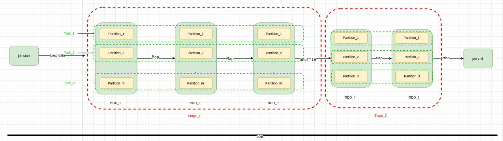
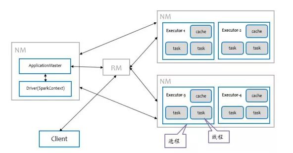

#### Spark集群中的并发计算

* 一个数据处理Job需要经过加载数据->数据计算->结果保存三个步骤。在处理海量数据时为了提高处理效率需要对数据进行并发计算，这需要将"数据计算"的Job拆分成可以并行运行的task，那么如何拆分呢？为了提高并行效率拆分出的tasks间需要是独立的，即并行执行时不需要进行数据shuffle。要满足这两点首先需要根据shuffle操作将Job拆分成不同的Stage，每个Stage内部不会进行数据shuffle操作。在此基础上这样就可以将海量数据拆分出不同的partition，然后每个task处理一个partition，因为之前已经根据shuffle将程序分割成了不同stage，所以同一stage内处理不同partition的tasks在并行计算时就不会进行数据shuffle。这样从程序和数据两个维度将一个数据计算Job拆分出不同的tasks，同一个stage内的tasks对不同partition并行计算，所以并行计算的独立执行单位是task。

* Job的拆分是并行计算的准备工作，接下来就是需要将Job的tasks分配到集群中不同的机器上并行运行。那么这些task在集群中是怎样存在的呢？首先要明确的是为了确保集群中每台机器的利用率，不能让一个Job的tasks独占一台机器，但又不能让不同Job的tasks间相互影响，所以一个Job的tasks（可同时分配多个task到一台机器）被分配到集群中某个机器上时是以进程的形式存在的，这样每台机器可以同时运行多个Job的task，也不会相互影响，在Spark集群中这种能够独立运行一个Job的tasks的进程称之为executor，一个executor内有多个线程，每个线程对应一个task，进程所需的数据是保存在内存或磁盘中的。executor既然是集群中执行子模块的进程，那就可以随时申请和释放，因此可以把executor看作集群资源调度的基本单位。

* 已经清楚Spark中如何拆分Job成tasks，以及tasks在集群如何运行。那么怎样管理这两个过程呢？Spark中有一个单独的节点负责运行Driver Program进行任务调度，通过Transaction操作形成RDD血缘关系图，即DAG图，最后通过Action调用触发job并调度执行。同时有一个外部服务ClusterManager，负责分配集群资源。

* Spark Application是使用Spark并行处理海量数据的程序
* Job,一个Spark Application可以拆分出不同的Jobs，拆分依据是处理程序促发Spark中的action操作
* Stage,根据程序中的shuffle操作将一个Job拆分成不同的Stages，一个Stage内不会进行数据shuffle
* RDD,Spark中的基本数据结构，是一个不可变的对象集合
* Partition,为了并行处理RDD，需要将一个RDD拆分成不同的partition并存储在集群中各个节点上进行并行计算，每一种RDD都有对应的拆分逻辑。
* Task，一个Stage内的对一个Partition的计算单元

#### Spark运行原理

以spark on yarn为例，阐述Spark运行原理

* Spark任务运行步骤
  1. 客户端提交Spark Applicaiton到RM（Resource Manager）,RM判断集群资源是否满足需求。
  2. RM在客户端所在机器或者在集群中选择一台NodeManager作为Driver Node启动Application Master
  3. Driver在AM所在的NodeManager节点启动进程
  4. AM向RM申请资源，并在每台NM上启动相应的executors
  5. Driver开始进行任务调度，通过Transaction操作形成了RDD血缘关系图，即DAG图，最后通过Action调用触发job并调度执行。
  6. DAGScheduler负责Stage级的调度，主要是将DAG切分成若干个Stages，并将每个Stage打包成TaskSet交给TaskScheduler调度。
  7. TaskScheduler负责Task级的调度，将DAGScheduler给过来的Taskset按照指定的调度策略分发到Executor上执行

#### 参考
  1. https://zhuanlan.zhihu.com/p/97777405
  2. http://spark.apache.org/docs/latest/cluster-overview.html
  3. https://www.tutorialspoint.com/apache_spark/apache_spark_rdd.htm
  4. https://intellipaat.com/blog/tutorial/spark-tutorial/programming-with-rdds/
  5. https://blog.csdn.net/u011564172/article/details/53611109
  6. https://blog.csdn.net/q996676479/article/details/80098946

