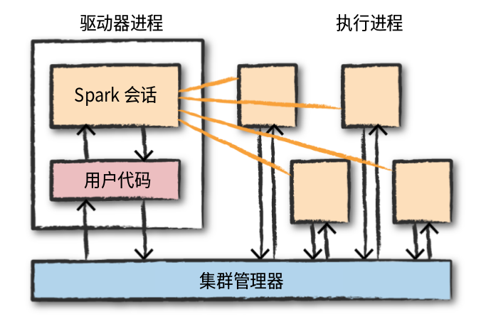

#### 大数据问题

* 单处理器性能的发展跟不上数据计算和处理的需求从而专向增加更多相同计算能力的并行CPU计算。
* 数据采集和存储成本的降低，累积大量数据。

#### 什么是Spark

* 在集群上运行的统一的计算引擎以及一组并行数据处理软件库。
  * 统一的平台
    spark api的统一，针对不同类型，不同存储系统上的数据处理任务提供了一套统一的可组合的api。
  * 计算引擎
    spark不负责数据的持久化，支持多种数据存储系统，专注与对数据的执行和计算，这样应用程序无需担心数据存储对数据处理的影响。
  * 配套的软件库
    为数据分析提供统一的api
    
#### Spark集群中的并发计算

* 一个数据处理Job需要经过加载数据->数据计算->结果保存三个步骤。在处理海量数据时为了提高处理效率需要对数据进行并发计算，这需要将"数据计算"的Job拆分成可以并行运行的task，那么如何拆分呢？为了提高并行效率拆分出的tasks间需要是独立的，即并行执行时不需要进行数据shuffle。要满足这两点首先需要根据shuffle操作将Job拆分成不同的Stage，每个Stage内部不会进行数据shuffle操作。在此基础上这样就可以将海量数据拆分出不同的partition，然后每个task处理一个partition，因为之前已经根据shuffle将程序分割成了不同stage，所以同一stage内处理不同partition的tasks在并行计算时就不会进行数据shuffle。这样从程序和数据两个维度将一个数据计算Job拆分出不同的tasks，同一个stage内的tasks对不同partition并行计算，所以并行计算的独立执行单位是task。

* Job的拆分是并行计算的准备工作，接下来就是需要将Job的tasks分配到集群中不同的机器上并行运行。那么这些task在集群中是怎样存在的呢？首先要明确的是为了确保集群中每台机器的利用率，不能让一个Job的tasks独占一台机器，但又不能让不同Job的tasks间相互影响，所以一个Job的tasks（可同时分配多个task到一台机器）被分配到集群中某个机器上时是以进程的形式存在的，这样每台机器可以同时运行多个Job的task，也不会相互影响，在Spark集群中这种能够独立运行一个Job的tasks的进程称之为executor，一个executor内有多个线程，每个线程对应一个task，进程所需的数据是保存在内存或磁盘中的。executor既然是集群中执行子模块的进程，那就可以随时申请和释放，因此可以把executor看作集群资源调度的基本单位。

* 已经清楚Spark中如何拆分Job成tasks，以及tasks在集群如何运行。那么怎样管理这两个过程呢？Spark应用程序包含两部分，一是执行驱动程序的driver进程，而是执行计算任务的executor进程。
  * driver program 
    主要负责维护spark环境，分析并分发Spark任务。通过Transaction操作形成RDD血缘关系图，即DAG图，最后通过Action调用触发job并调度执行。
  * executor进程
    执行器进程负责执行分配到的计算任务，并将计算状态报告给运行驱动进程的节点。
  * 集群管理器
    集群由Spark、YARN、Mesos集群管理起中的一种来管理，主要负责给driver发送的任务分配资源。\
    

* Spark Application是使用Spark并行处理海量数据的程序
* Job,一个Spark Application可以拆分出不同的Jobs，拆分依据是处理程序促发Spark中的action操作
* Stage,根据程序中的shuffle操作将一个Job拆分成不同的Stages，一个Stage内不会进行数据shuffle
* RDD,Spark中的基本数据结构，是一个不可变的对象集合
* Partition,为了并行处理RDD，需要将一个RDD拆分成不同的partition并存储在集群中各个节点上进行并行计算，每一种RDD都有对应的拆分逻辑。
* Task，一个Stage内的对一个Partition的计算单元
* 转换操作(transformation)，spark中的基本数据结构是不可变的，因此对它的任何操作都会将它转换成另一个数据单元，如果在转换过程中数据发生shuffle则前后的数据为宽依赖，否则为窄依赖。
* 惰性，转换操作不会立刻执行，而是简历一个对数据进行转换操作的流，等必须要使用该数据时才会执行，这样可以从操作流整体上进行优化。
* action操作，促发action操作时表示需要执行前面的转换流，一般action操作分为三类
  * 在控制台查看数据
  * 在某个语言中将数据汇集为原生对象
  * 数据持久化
  

#### Spark运行原理

以spark on yarn为例，阐述Spark运行原理

* Spark任务运行步骤
  1. 客户端提交Spark Applicaiton到RM（Resource Manager）,RM判断集群资源是否满足需求。
  2. RM在客户端所在机器或者在集群中选择一台NodeManager作为Driver Node启动Application Master
  3. Driver在AM所在的NodeManager节点启动进程
  4. AM向RM申请资源，并在每台NM上启动相应的executors
  5. Driver开始进行任务调度，通过Transaction操作形成了RDD血缘关系图，即DAG图，最后通过Action调用触发job并调度执行。
  6. DAGScheduler负责Stage级的调度，主要是将DAG切分成若干个Stages，并将每个Stage打包成TaskSet交给TaskScheduler调度。
  7. TaskScheduler负责Task级的调度，将DAGScheduler给过来的Taskset按照指定的调度策略分发到Executor上执行

#### Spark任务执行流程

1. 将我们编写的程序打成 jar 包。

2. 调用spark-submit脚本提交任务到集群上运行。

3. 运行 sparkSubmit 的 main 方法，在这个方法中通过反射的方式创建我们编写的主类的实例对象，然后调用 main 方法，开始执行我们的代码。

4. 当代码运行到创建 SparkContext 对象时，那就开始初始化 SparkContext 对象了

5. 在初始化 SparkContext 对象的时候，会创建两个特别重要的对象，分别是DAGScheduler和TaskScheduler。DAGScheduler的作用是将RDD的依赖切分成一个一个的stage，然后将stage作为taskSet提交给 DriverActor。

6. 在构建 TaskScheduler 的同时，会创建两个非常重要的对象，分别是 DriverActor 和ClientActor。clientActor的作用是向master注册用户提交的任务，DriverActor 的作用接受executor的反向注册，将任务提交给 executor。

7. 当 ClientActor 启动后，会将用户提交的任务和相关的参数封装到 ApplicationDescription对象中，然后提交给 master 进行任务的注册。

8. 当 master 接受到 clientActor 提交的任务请求时，会将请求参数进行解析，并封装成Application，然后将其持久化，然后将其加入到任务队列waitingApps中。

9. 当轮到我们提交的任务运行时，就开始调用schedule()，进行任务资源的调度

10. master将调度好的资源封装到launchExecutor中发送给指定的worker。

11. worker接受到Master发送来的launchExecutor时，会将其解压并封装到ExecutorRunner中，然后调用这个对象的start(), 启动Executor。

12. Executor启动后会向DriverActor进行反向注册。

13. driverActor 会发送注册成功的消息给Executor。

14. xecutor接受到DriverActor注册成功的消息后会创建一个线程池，用于执行 DriverActor发送过来的task任务

15. 当属于这个任务的所有的Executor启动并反向注册成功后，就意味着运行这个任务的环境已经准备好了，driver会结束SparkContext对象的初始化，也就意味着 new SparkContext这句代码运行完成。

16. 当初始化sc成功后，driver端就会继续运行我们编写的代码，然后开始创建初始的RDD，然后进行一系列转换操作，当遇到一个 action算子时，也就意味着触发了一个job。

17. driver会将这个job提交给DAGScheduler。

18. DAGScheduler将接受到的job，从最后一个算子向前推导，将DAG依据宽依赖划分成一个一个的 tage，然后将stage封装成taskSet，并将taskSet中的task提交给DriverActor。

19. DriverActor接受到DAGScheduler发送过来的task，会拿到一个序列化器，对task进行序列化，然后将序列化好的task封装到launchTask中，然后将launchTask发送给指定的Executor。

20. Executor接受到了DriverActor发送过来的launchTask时，会拿到一个反序列化器，对launchTask进行反序列化，封装到TaskRunner中，然后从Executor这个线程池中获取一个线程，将反序列化好的任务中的算子作用在 RDD 对应的分区上

#### 参考（不分先后顺序）
  1. https://zhuanlan.zhihu.com/p/97777405
  2. http://spark.apache.org/docs/latest/cluster-overview.html
  3. https://www.tutorialspoint.com/apache_spark/apache_spark_rdd.htm
  4. https://intellipaat.com/blog/tutorial/spark-tutorial/programming-with-rdds/
  5. https://blog.csdn.net/u011564172/article/details/53611109
  6. https://blog.csdn.net/q996676479/article/details/80098946
  7.《spark权威指南》